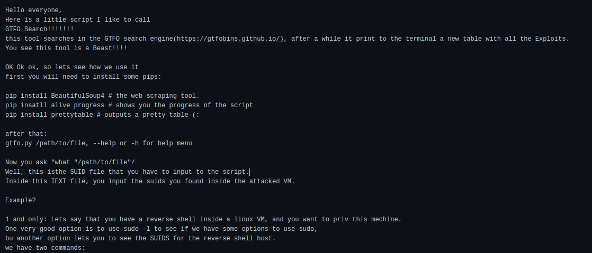
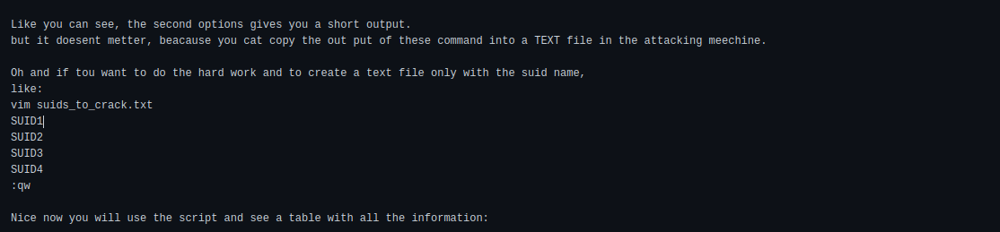
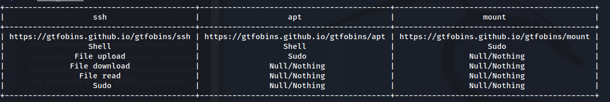

# GTFO_search




``` 
$ find / -type f -a \( -perm -u+s -o -perm -g+s \) -exec ls -l {} \; 2> /dev/null
-rwsr-xr-x 1 root root 114784 Jun 28  2021 /usr/sbin/SUID1
-rwsr-xr-x 1 root root 48128 Dec 14 12:15 /usr/sbin/SUID2
-rwsr-xr-- 1 root dip 403752 Jan  7  2021 /usr/sbin/SUID3
-rwxr-sr-x 1 root shadow 38912 Dec  6 21:11 /usr/sbin/SUID4 
```
Or the command
```
>$ find / -perm -u=s -type f 2>/dev/null
>/usr/sbin/SUID1
>/usr/bin/SUID2
>/usr/bin/SUID3
>/usr/lib/openssh/SUID4

```
    





